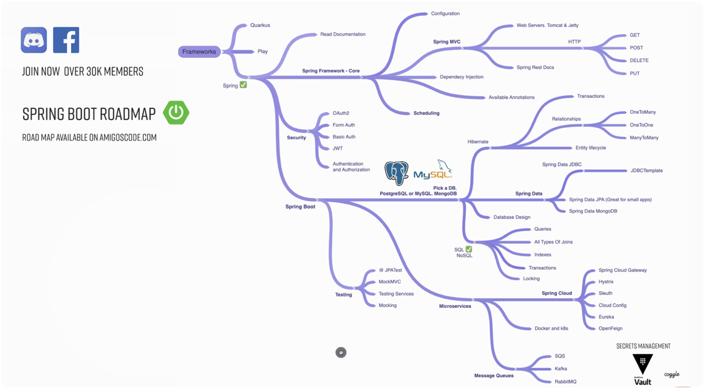
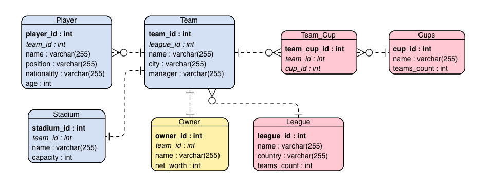
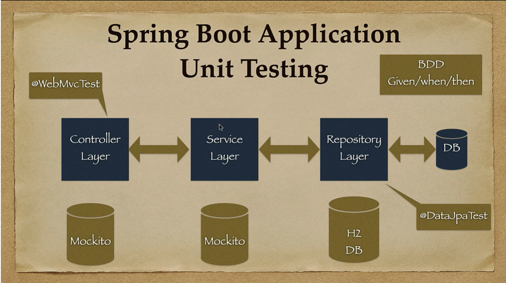
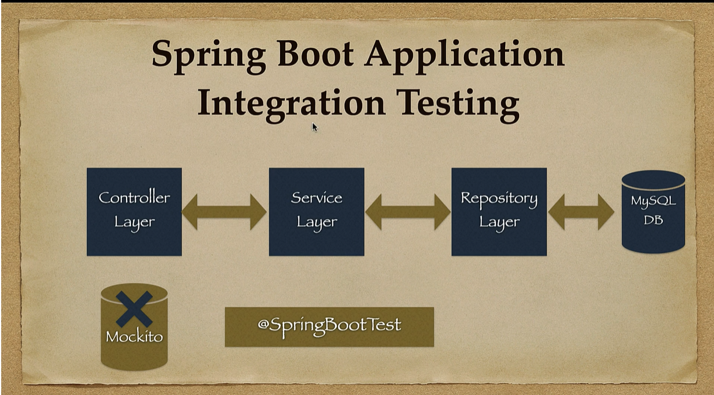

# Football-Club-Management-System

FCMS is a Spring Boot REST API for dealing with the management of Football Clubs.

## Table of Contents

[0. Getting Started](#0-getting-started)
<br>
[1. Motivation](#1-motivation)
<br>
[2. REST API Design](#2-rest-api-design)
<br>
&nbsp;&nbsp;&nbsp;&nbsp;&nbsp;[2.1 ERD](#21-erd)
<br>
&nbsp;&nbsp;&nbsp;&nbsp;&nbsp;[2.2 Deciding Foreign Keys in a Relationship](#22-deciding-foreign-keys-in-a-relationship)
<br>
[3. Spring Boot REST API Development](#3-spring-boot-rest-api)
<br>
&nbsp;&nbsp;&nbsp;&nbsp;&nbsp;[3.1 Project Setup](#31-project-setup)
<br>
&nbsp;&nbsp;&nbsp;&nbsp;&nbsp;&nbsp;&nbsp;&nbsp;&nbsp;&nbsp;[3.1.1 Initialise Spring Boot Project](#311-initialise-spring-boot-project)
<br>
&nbsp;&nbsp;&nbsp;&nbsp;&nbsp;&nbsp;&nbsp;&nbsp;&nbsp;&nbsp;[3.1.2 Connect Spring Boot to Database](#312-connect-spring-boot-to-database)
<br>
&nbsp;&nbsp;&nbsp;&nbsp;&nbsp;[3.2 Model / Entity Layer](#32-model--entity-layer)
<br>
&nbsp;&nbsp;&nbsp;&nbsp;&nbsp;&nbsp;&nbsp;&nbsp;&nbsp;&nbsp;[3.2.1 DTO](#321-dto)
<br>
&nbsp;&nbsp;&nbsp;&nbsp;&nbsp;&nbsp;&nbsp;&nbsp;&nbsp;&nbsp;[3.2.2 Mapper](#322-mapper)
<br>
&nbsp;&nbsp;&nbsp;&nbsp;&nbsp;[3.3 Repository Layer](#33-repository-layer)
<br>
&nbsp;&nbsp;&nbsp;&nbsp;&nbsp;[3.4 Service Layer](#34-service-layer)
<br>
&nbsp;&nbsp;&nbsp;&nbsp;&nbsp;&nbsp;&nbsp;&nbsp;&nbsp;&nbsp;[3.4.1 Exception Handling](#341-exception-handling)
<br>
&nbsp;&nbsp;&nbsp;&nbsp;&nbsp;[3.5 Controller Layer](#35-controller-layer)
<br>
&nbsp;&nbsp;&nbsp;&nbsp;&nbsp;&nbsp;&nbsp;&nbsp;&nbsp;&nbsp;[3.5.1 Extra CRUD Methods/Endpoints](#351-extra-crud-methodsendpoints)
<br>
[4. Extra Features to Consider](#4-extra-features-to-consider)
<br>
&nbsp;&nbsp;&nbsp;&nbsp;&nbsp;[4.1 Documentation](#41-documentation)
<br>
&nbsp;&nbsp;&nbsp;&nbsp;&nbsp;[4.2 Logging](#42-logging)
<br>
&nbsp;&nbsp;&nbsp;&nbsp;&nbsp;[4.3 Testing](#43-testing)
<br>
&nbsp;&nbsp;&nbsp;&nbsp;&nbsp;[4.4 Security](#44-security)
<br>
&nbsp;&nbsp;&nbsp;&nbsp;&nbsp;[4.5 Lombok - JPA](#45-lombok---jpa)
<br>

## 0. Getting Started

## Building & Running the Application

### Prerequisites

- Git
- Java 1.8
- Maven for building the project (optional if you use the Maven wrapper included in the project).
- IDE of your choice (optional for running directly from the IDE).
- Postman (optional for making API calls)

### Cloning the Repository

1. Open your terminal or command prompt.

2. Clone the repository using Git:

   ```bash
   git clone https://github.com/arsy786/football-club-management-system.git
   ```

3. Navigate to the cloned repository's root directory:

   ```bash
   cd football-club-management-system
   ```

### Using Maven Wrapper

1. Navigate to the project's root directory in your terminal and run:

   ```bash
   ./mvnw clean package
   ```

   This command compiles the application and packages it into a runnable .jar file located in the target directory.

2. If you have Maven installed globally, you can run:

   ```bash
   mvn clean package
   ```

3. After building the application, you can run it using the following command:

   ```bash
   java -jar target/football-club-management-system-0.0.1-SNAPSHOT.jar
   ```

## Using the API

Swagger.

## 1. Motivation

The purpose of this project is to grow my knowledge of Spring Boot. I plan to gradually implement new features to steadily grow my understanding of the framework, as well as concepts surrounding REST API development.



I came across a 'Spring Boot Roadmap' and used it as a guide to structure my learning. After boring myself with watching many hours of courses/tutorials and reading plenty of articles/forums limited to basic 1 entity REST APIs (that lacked any progression in complexity), I realised that I actually did not know how to apply ANY of the new concepts I had 'learnt'.

Eventually, I decided that the best way to grasp these concepts would be to actually implement the theory & guides into a project that interests me (and is also designed by me)!

Designing my own application means that I can test my understanding and skills from the very ground up. I am a fan of football therefore the idea of building the FCMS REST API came natural to me.

I will be using this README.md file to add any notes, features, plans and details regarding the management of the entire project! This will essentially serve as a blueprint for any future Spring Boot REST APIs I plan to build! :)

## 2. REST API Design

### 2.1 ERD



I wanted to design the Entity Relationship Diagram (ERD) so that I could make use of all JPA relationships available.

| Description                                                          | JPA Relationship |
| -------------------------------------------------------------------- | ---------------- |
| **A** Team has **many** Players                                      | @OneToMany       |
| **Many** Teams play in **a** League                                  | @ManyToOne       |
| **A** Team has **an** Owner                                          | @OneToOne        |
| **A** Team has **a** Stadium                                         | @OneToOne        |
| **A** Team plays in **many** Cups AND **a** Cup has **many** Teams\* | @ManyToMany      |

\*Another way of describing this is, **a** Team can play in **many** Cups (and **many** Teams can play in the **same** Cup)

NOTE: @ManyToMany = @OneToMany + @ManyToOne

### 2.2 Deciding Foreign Keys in a Relationship

@ManyToOne:

- FK (and config) in Many (Child) side.
- If you want a bidirectional relationship, must add List< Child > field and map the corresponding @OneToMany annotation in Parent entity.

Bi-directional relationship example:

```java
public class Child {

    @Id
    @GeneratedValue(strategy = GenerationType.IDENTITY)
    private Long childId;

    @ManyToOne
    @JoinColumn(name = "parent_id", referencedColumnName = "parentId") //fk
    private Parent parent;
}

public class Parent {

    @Id
    @GeneratedValue(strategy = GenerationType.IDENTITY)
    private Long parentId;

    @OneToMany(mappedBy = "parent")
    private List<Child> children;
}
```

@OneToOne / OneTo(Perhaps)One:

- FK in either side.
- FK preferred in Dependent entity (if one exists).
- Example of independent/dependent entity: a _Student is independent of a Student Mentor_,
  the **Student Mentor only exists if the Student does**. Therefore, _Student Mentor is dependent on Student_.

Student (Independent) and Student Mentor (Dependent) relationship Example:

```java
public class StudentMentor {

    @Id
    @GeneratedValue(strategy = GenerationType.IDENTITY)
    private Long studentMentorId;

    @OneToOne
    @JoinColumn(name = "student_id", referencedColumnName = "studentId") //fk
    private Student student;
}

public class Student {

    @Id
    @GeneratedValue(strategy = GenerationType.IDENTITY)
    private Long studentId;

    @OneToOne(mappedBy = "student")
    private StudentMentor studentMentor;
}
```

@ManyToMany:

- Need intermediate table (Join Table) with FK from both sides, which combine to form a composite key.
- This can be configured on either side in Java, but it is preferred to do the config in the Dependent entity.
- Example of a ManyToMany relationship: X can have many Y's AND Y can have many X's.
- Cup is the dependent entity as Cups only exist if the Teams do.

Team (Independent) and Cup (Dependent) relationship example:

```java
public class Cup {

    @Id
    @GeneratedValue(strategy = GenerationType.IDENTITY)
    private Long cupId;

    @ManyToMany
    @JoinTable(
            name = "team_cup_map",
            joinColumns = @JoinColumn(name = "cup_id", referencedColumnName = "cupId"),
            inverseJoinColumns = @JoinColumn(name = "team_id", referencedColumnName = "teamId")
    ) // both fk's for intermediate table
    private List<Team> teams;
}

public class Team {

    @Id
    @GeneratedValue(strategy = GenerationType.IDENTITY)
    private Long teamId;

    @ManyToMany(mappedBy = "teams")
    private List<Cup> cups;
}
```

NOTE: FK in Child/Dependent table references its PK in Parent/Independent table.

Q) How to decide if you should have @OneToOne table or merge the attributes into 1 table?
<br>
A) If data in one table is related to, BUT does NOT 'belong' to the entity described by the other, then keep separate.

## 3. Spring Boot REST API

_DISCLAIMER: All features (Entity, DTO, Controller, etc.) associated with 'Team' will aim to maintain the highest coding standards; implement the most concepts/features; and contain the most detail in regard to complying with REST API development standards._

_Features associated with other Models (Player, Owner, etc.) will only contain what is necessary and convenient for a project of this scale e.g. other Controllers will not contain OpenAPI documentation simply for convenience, code readability and code reusability._

### 3.1 Project Setup

### 3.1.1 Initialise Spring Boot Project

- [Spring Initalizr](https://start.spring.io)
- Maven, Java, Jar, 8
- MUST: Spring Web, Spring Data JPA, Database (H2, Mongo, etc.)
- OPTIONAL: Spring Rest Dev Tools, REST Repos, Spring Web Services, etc.
- [Maven artifact and group naming conventions (StackOverflow)](https://stackoverflow.com/questions/23172586/maven-artifact-and-group-naming-conventions)

### 3.1.2 Connect Spring Boot to Database

- Connect easily via Spring Data JPA.
- Add configuration to applications.properties file to setup DB connections (and other features i.e. port).
- Example of H2 database connection setup with console enabled and data pre-loaded:

```properties
server.port=8080

spring.datasource.url=jdbc:h2:mem:testdb
spring.datasource.driverClassName=org.h2.Driver
spring.datasource.username=sa
spring.datasource.password=
spring.datasource.platform=h2

spring.jpa.database-platform=org.hibernate.dialect.H2Dialect
spring.jpa.defer-datasource-initialization=true
spring.jpa.hibernate.ddl-auto=create-drop

spring.h2.console.enabled=true
spring.h2.console.path=/h2-console
```

- Can add initial data by adding file-name.sql in resources folder and adding these lines to application.properties:

```properties
spring.sql.init.mode=always
spring.sql.init.data-locations=classpath:file-name.sql
```

- file-name.sql will contain SQL statements to populate the entities created by JPA/Hibernate during Spring Boot start-up:

```sql
INSERT INTO team (name, city, manager)
VALUES ('Manchester United F.C.', 'Manchester', 'Erik ten Hag');

INSERT INTO team (name, city, manager)
VALUES ('Manchester City F.C.', 'Manchester', 'Pep Guardiola');
```

NOTE: Adding initial data is useful in a DEV environment for testing purposes, but is not needed in production.

### 3.2 Model / Entity Layer

- Create a POJO for your Models/Entities.
- This class (entity) will be registered with Hibernate as result of implementing JPA Annotations.
- Can add attributes (name, nullable, unique, etc.) to JPA Annotations (@Table, @Column, etc.) to add constraints to DB.
- Can use Lombok annotations to reduce boilerplate code.

NOTE: Use the annotations from javax.persistence.\* for adding constraints in the Model layer.
<br>
NOTE: [Be careful of Lombok - JPA integration](#45-lombok---jpa)

JPA Annotations with Lombok example:

```java
@Getter
@Setter
@AllArgsConstructor
@NoArgsConstructor
@Entity
@Table(name = "user")
public class User {

    @Id
    @GeneratedValue(strategy = GenerationType.IDENTITY)
    private Long id;

    @Column(name = "name", nullable = false, unique = true)
    private String userName;

    @Column(name = "email", nullable = false, unique = true)
    private String email;

    @Column(name = "bio")
    private String bio;

}
```

- [Link to understanding JPA Entities and Annotations (Baeldung)](https://www.baeldung.com/jpa-entities)

_For code implementation example(s) check:_
[Team.java](https://github.com/arsy786/football-club-management-system/blob/master/src/main/java/dev/arsalaan/footballclubmanagementsystem/model/Team.java)
or
[Cup.java](https://github.com/arsy786/football-club-management-system/blob/master/src/main/java/dev/arsalaan/footballclubmanagementsystem/model/Cup.java)

### 3.2.1 DTO

- DTO (data transfer object) is an object that carries data between processes.
- DTOs for JPA entities generally contain a subset of entity attributes.
- For example, if you need to expose only a few of the entity attributes via REST API, you can map entities to DTOs with those attributes and serialize only them.
- Basically, DTOs allow you to decouple presentation/business logic layer from the data access layer.
- Can use Lombok annotations to reduce boilerplate code.

NOTE: [Can use JPA Buddy to generate DTOs (YouTube/JPABuddy)](https://www.youtube.com/watch?v=_u-qn-R4DoA)
<br>
NOTE: DTOs solve Jackson JSON infinite recursion problem for bidirectional relationships.

User model vs. UserDto example:

```java
@Data
public class User {
    private String id;
    private String name;
    private String password;
    private List<Role> roles;
}

@Data
public class UserDto {
    private String name;
    private List<String> roles;
}
```

- Can use DTOs to reference other entities via associations.

OwnerDto containing PetDto id and name example:

```java
@Data
public class OwnerDto implements Serializable {
    private final Long ownerId;
    private final String name;
    private final String country;
    private final List<PetDto> pets;

    @Data
    public static class PetDto implements Serializable {
        private final Long petId;
        private final String name;
    }
}
```

- Can use Java Bean Validation annotations on fields (@NonBlank, @Email, etc.) to validate user inputs.
- Some annotations accept additional attributes, but the "message" attribute is common to all of them. This is the message that will usually be rendered when the value of the respective property fails validation.

NOTE: Use the annotations from javax.validation.constraints.\* for adding validation in the DTO layer.

Java Bean Validation example:

```java
public class UserDto {

  @NotNull(message = "Name cannot be null")
  private String name;

  @NotEmpty
  @Size(min = 8, message = "password should have at least 8 characters")
  private String password;

  @Size(min = 10, max = 200, message
          = "About Me must be between 10 and 200 characters")
  private String aboutMe;

  @Min(value = 18, message = "Age should not be less than 18")
  @Max(value = 150, message = "Age should not be greater than 150")
  private int age;

  @Email(message = "Email should be valid")
  private String email;

  // standard setters and getters
}
```

- [Link to Java Bean Validation Basics (Baeldung)](https://www.baeldung.com/javax-validation#overview)

_For code implementation example(s) check:_
[TeamDTO.java](https://github.com/arsy786/football-club-management-system/blob/master/src/main/java/dev/arsalaan/footballclubmanagementsystem/dto/TeamDTO.java)
or
[CupDTO.java](https://github.com/arsy786/football-club-management-system/blob/master/src/main/java/dev/arsalaan/footballclubmanagementsystem/dto/CupDTO.java)

### 3.2.2 Mapper

- Mapper is a technique to transfer data from DTOs to Entitys or vice versa.
- MapStruct is a code generator that greatly simplifies the implementation of mappings.
- When using MapStruct, you only define simple method signatures, converting Entity to DTO, DTO to Entity, List of Entity to List of DTOs.
- The MapStruct annotation (@Mapper) will generate implementation code for you during build time.

NOTE: [Can use JPA Buddy to generate Mappers (YouTube/JPABuddy)](https://www.youtube.com/watch?v=_u-qn-R4DoA)
<br>
NOTE: If using MapStruct, ensure that you run **[mvn clean compile/install](https://stackoverflow.com/questions/58580132/mapstruct-ignores-fields)** before starting application.
<br>
NOTE: Ensure correct configuration when using MapStruct and Lombok in the same project.

Example of Mapper class with MapStruct @Mapper Annotation:

```java
@Mapper(componentModel = "spring")
public interface UserMapper {

    UserDto userToUserDto (User user);

    List<UserDto> usersToUsersDto(List<User> users);

    User userDtoToUser(UserDto userDto);
}
```

_For code implementation example(s) check:_
[TeamMapper.java](https://github.com/arsy786/football-club-management-system/blob/master/src/main/java/dev/arsalaan/footballclubmanagementsystem/mapper/TeamMapper.java)
or
[CupMapper.java](https://github.com/arsy786/football-club-management-system/blob/master/src/main/java/dev/arsalaan/footballclubmanagementsystem/mapper/CupMapper.java)

### 3.3 Repository Layer

- This will interact with the underlying DB.
- To program CRUD (and JPA) operations on Student entities, need to have a StudentRepository interface.
- Spring Data provides a layer on top of JPA that offers convenient ways to reduce boiler plate code.
- CrudRepository interface extends Repository to provide CRUD functionality.
- JpaRepository interface extends CrudRepository to give us the JPA specific features.
- For functions that are not already present in JpaRepo, add new methods/queries in the StudentRepository interface.
- For simple queries, Spring can easily derive what the query should be from just the method name.

Example of a simple query:

```java
public interface BookRepository extends JpaRepository<Book, Long> {

    List<Book> findByName(String name);

}
```

- For more complex queries, can annotate a repository method with the @Query annotation where the value contains the JPQL or SQL to execute.

Example of complex queries:

```java
public interface BookRepository extends JpaRepository<Book, Long> {

    @Query("select b from Book b where upper(b.title) like concat('%',upper(:title), '%')")
    List<Book> findByTitle(@Param("title") String title);

}

public interface StudentRepository extends JpaRepository<Student, Long> {

    @Query("SELECT s FROM Student s WHERE s.email = ?1")
    Optional<Student> findStudentByEmail(String email);

}
```

_For code implementation example(s) check:_
[TeamRepository.java](https://github.com/arsy786/football-club-management-system/blob/master/src/main/java/dev/arsalaan/footballclubmanagementsystem/repository/TeamRepository.java)
or
[CupRepository.java](https://github.com/arsy786/football-club-management-system/blob/master/src/main/java/dev/arsalaan/footballclubmanagementsystem/repository/CupRepository.java)

### 3.4 Service Layer

- The Service is where all the implementation is done, and it interacts with the Repository (DB) and Controller layers.
- It will only take the data from the Controller layer and transfer it to the Repository layer.
- It will also take the data from the Repository layer and send it back to the Controller layer.
- The Service exposes methods that will be called from the Controller.
- This layer is where all the business logic code is implemented, which consists of basic CRUD methods.

NOTE: DTOs are injected in this layer, as any response being passed to the Controller must be in the form of a DTO.

_For code implementation example(s) check:_
[TeamService.java](https://github.com/arsy786/football-club-management-system/blob/master/src/main/java/dev/arsalaan/footballclubmanagementsystem/service/TeamService.java)
or
[CupService.java](https://github.com/arsy786/football-club-management-system/blob/master/src/main/java/dev/arsalaan/footballclubmanagementsystem/service/CupService.java)

### 3.4.1 Exception Handling

- Handling errors correctly in APIs while providing meaningful error messages is a very desirable feature, as it can help the API client properly respond to issues. The default behavior tends to be returning stack traces that are hard to understand and ultimately useless for the API client.
- Partitioning the error information into fields enables the API client to parse it and provide better error messages to the user.
- [Spring Boot Tutorial | How To Handle Exceptions (YouTube/AmigosCode)](https://www.youtube.com/watch?v=PzK4ZXa2Tbc&t=355s)
- [Guide to Spring Boot REST API Error Handling (toptal/BrunoLeite)](https://www.toptal.com/java/spring-boot-rest-api-error-handling)

_For code implementation example(s) check:_
[.../exception/](https://github.com/arsy786/football-club-management-system/blob/master/src/main/java/dev/arsalaan/footballclubmanagementsystem/exception/)

### 3.5 Controller Layer

- Now we can implement a Controller class to define our API URLs and use the Service class to manage data.
- Different methods are defined in the Controller, these methods will be called by different endpoints.
- The endpoint methods in the Controller typically match those in its corresponding Service layer.
- Controller consumes (via endpoint) and responds (via service) with DTO's only.
- Handles HTTP requests.
- Can use Java Bean Validation Annotation (@Valid) to enable validation within the Controller layer.
- The @Valid Annotation ensures the validation of an object passed as a method argument.

The Basic/Standard HTTP REST API calls and their corresponding methods:

| Endpoint                          | Method           |
| --------------------------------- | ---------------- |
| (GET) api/v1/entity/              | getAllEntities   |
| (GET) api/v1/entity/{entityId}    | getEntityById    |
| (POST) api/v1/entity              | createEntity     |
| (PUT) api/v1/entity/{entityId}    | updateEntityById |
| (DELETE) api/v1/entity/{entityId} | deleteEntityById |

_For code implementation example(s) check:_
[TeamController.java](https://github.com/arsy786/football-club-management-system/blob/master/src/main/java/dev/arsalaan/footballclubmanagementsystem/controller/TeamController.java)
or
[CupController.java](https://github.com/arsy786/football-club-management-system/blob/master/src/main/java/dev/arsalaan/footballclubmanagementsystem/controller/CupController.java)

### 3.5.1 Extra CRUD Methods/Endpoints

- Once the basic CRUD methods are added to the Service/Controller layers, if the entity has relationships with other entities... Extra CRUD methods can be implemented.
- @ManyToOne: logic in Child Service layer
- @OneToOne: logic is either not required OR in the Dependent entity service layer (e.g. Student Mentor exists if Student does)
- @ManyToMany: logic in either side OR in the Dependent side (if applicable)

The Extra HTTP REST API calls for entity rships:

| Entity Relationship | Endpoints                                                                                                                                                                                        | Extra CRUD Methods                                                                                 |
| ------------------- | ------------------------------------------------------------------------------------------------------------------------------------------------------------------------------------------------ | -------------------------------------------------------------------------------------------------- |
| @ManyToOne          | (GET) api/v1/child/parent/{parentId} <br> (PUT) api/v1/child/{childId}/parent/{parentId} <br> (DELETE) api/v1/child/{childId}/parent/{parentId}                                                  | viewAllChildrenForParent <br> addChildToParent <br> removeChildFromParent                          |
| @OneToOne           | (GET) api/v1/dependent/independent/{independentId} <br> (PUT)api/v1/dependent/{dependentId}/independent/{independentId} <br> (DELETE) api/v1/dependent/{dependentId}/independent/{independentId} | viewDependentForIndependent <br> addDependentToIndependent <br> removeDependentFromIndependent     |
| @ManyToMany         | (GET) api/v1/dependent/independent/{independentId} <br> (PUT)api/v1/dependent/{dependentId}/independent/{independentId} <br> (DELETE) api/v1/dependent/{dependentId}/independent/{independentId} | viewAllDependentsForIndependent <br> addDependentToIndependent <br> removeDependentFromIndependent |

_For code implementation example(s) check:_
<br>
[@ManyToOne (League) - TeamController.java](https://github.com/arsy786/football-club-management-system/blob/master/src/main/java/dev/arsalaan/footballclubmanagementsystem/controller/TeamController.java)
<br>
[@OneToOne (Team) - OwnerController.java](https://github.com/arsy786/football-club-management-system/blob/master/src/main/java/dev/arsalaan/footballclubmanagementsystem/controller/OwnerController.java)
<br>
[@ManyToMany (Team) - CupController.java](https://github.com/arsy786/football-club-management-system/blob/master/src/main/java/dev/arsalaan/footballclubmanagementsystem/controller/CupController.java)

NOTE: Service layer logic differs between @ManyToMany and @ManyToOne relationships

For example -

@ManyToOne: To check if Child contains Parent (checking an Object)

```java
if (Objects.nonNull(player.getTeam()))
```

@ManyToMany: To check if Dependent contains Independent (checking a Collection of Objects)

```java
if (cup.getTeams.contains(team))
```

## 4. Extra Features to Consider

### 4.1 Documentation

- Swagger/OpenAPI
- Can add annotations (@Operation, @ApiResponses, @ApiResponse) in Controller layer to add more info to API description.
- [Can add @OpenAPIDefinition to add custom information about your APIs (GitHub)](https://github.com/swagger-api/swagger-core/wiki/Swagger-2.X---Annotations#OpenAPIDefinition)
- [Documenting a Spring REST API Using OpenAPI 3.0 (Baeldung)](https://www.baeldung.com/spring-rest-openapi-documentation)
- [How to change the URL for the OpenAPI doc and/or Swagger page (Medium)](https://medium.com/javarevisited/part-1-how-to-add-openapi-3-0-and-swagger-to-spring-boot-application-35c96422e94b)

_For code implementation example(s) check:_
[TeamController.java](https://github.com/arsy786/football-club-management-system/blob/master/src/main/java/dev/arsalaan/footballclubmanagementsystem/controller/TeamController.java)
and
[SwaggerConfig.java](https://github.com/arsy786/football-club-management-system/blob/master/src/main/java/dev/arsalaan/footballclubmanagementsystem/config/SwaggerConfig.java)

### 4.2 Logging

- Server logs record the activities or events that the system is performing at any given point in time.
- Each log entry contains information such as the timestamp, the actual method being called, a custom log message, and other contextual information.
- Each log entry also includes an identifier called a logging level.
- Logging in Spring Boot easily done without having to declare a constant logger class by using @Slf4j Annotation.
- Logs made in Exception Handler, Controller layer and Service layer.
- Can configure Logback (default for SB) settings in application.properties or elsewhere.
- Log Levels: ERROR, WARN, INFO, DEBUG, TRACE

For details on implementation: [Logging in Spring Boot with SLF4J (StackAbuse)](https://stackabuse.com/guide-to-logging-in-spring-boot/)
<br>
For details on best practices: [Logging Best Practices (tuhrig)](https://tuhrig.de/my-logging-best-practices/)

_For code implementation example(s) check:_
[TeamController.java](https://github.com/arsy786/football-club-management-system/blob/master/src/main/java/dev/arsalaan/footballclubmanagementsystem/controller/TeamController.java),
[TeamService.java](https://github.com/arsy786/football-club-management-system/blob/master/src/main/java/dev/arsalaan/footballclubmanagementsystem/service/TeamService.java),
[ApiExceptionHandler.java](https://github.com/arsy786/football-club-management-system/blob/master/src/main/java/dev/arsalaan/footballclubmanagementsystem/exception/ApiExceptionHandler.java)
and
[application.properties](https://github.com/arsy786/football-club-management-system/blob/master/src/main/resources/application.properties)

### 4.3 Testing

There are 4 levels to Testing:

| Testing Levels      | Description                |
| ------------------- | -------------------------- |
| Unit Testing        | Test individual components |
| Integration Testing | Test integrated components |
| System Testing      | Test entire system         |
| Acceptance Testing  | Test final system          |

Testing among different parties is divided into 4 parts:

| Acronym | Stage                   | Party                              |
| ------- | ----------------------- | ---------------------------------- |
| DEV     | Development             | Software developer                 |
| SIT     | System Integration Test | Software developer and QA engineer |
| UAT     | User Acceptance Test    | Client                             |
| PROD    | Production              | Public user                        |

[(more details)](https://medium.com/@buttertechn/qa-testing-what-is-dev-sit-uat-prod-ac97965ce4f)

_For code implementation example(s) check:_

| Unit Test(s)                                                                                                                                                                          | Integration Test                                                                                                                                                           | System (Integration) Test                                                                                                                                                                 |
| ------------------------------------------------------------------------------------------------------------------------------------------------------------------------------------- | -------------------------------------------------------------------------------------------------------------------------------------------------------------------------- | ----------------------------------------------------------------------------------------------------------------------------------------------------------------------------------------- |
| [Controller Layer](https://github.com/arsy786/football-club-management-system/blob/master/src/test/java/dev/arsalaan/footballclubmanagementsystem/controller/TeamControllerTest.java) | [MockMvc (Server-side)](https://github.com/arsy786/football-club-management-system/blob/master/src/test/java/dev/arsalaan/footballclubmanagementsystem/TeamMockMvcIT.java) | [TestRestTemplate (Client-side)](https://github.com/arsy786/football-club-management-system/blob/master/src/test/java/dev/arsalaan/footballclubmanagementsystem/TeamRestTemplateSIT.java) |
| [Service Layer](https://github.com/arsy786/football-club-management-system/blob/master/src/test/java/dev/arsalaan/footballclubmanagementsystem/service/TeamServiceTest.java)          | Cucumber                                                                                                                                                                   | Cucumber                                                                                                                                                                                  |
| [Repository Layer](https://github.com/arsy786/football-club-management-system/tree/master/src/test/java/dev/arsalaan/footballclubmanagementsystem/repository/TeamRepositoryTest.java) |                                                                                                                                                                            |                                                                                                                                                                                           |

There are different agile development philosophies, namely:

| Test Driver Development (TDD)                                   | Behaviour Driven Development (BDD)                                                                            |
| --------------------------------------------------------------- | ------------------------------------------------------------------------------------------------------------- |
| Focused on testing smaller pieces of functionality in isolation | Designed to test an application's behavior from the end user's standpoint                                     |
| Arrange, Act, Assert (AAA) approach (synonymous with GWT)       | Given, When, Then (GWT) approach (synonymous with AAA)                                                        |
| Reduces the time required for project development               | Very useful in business environments                                                                          |
| Developers write the tests                                      | Automated specifications are created by users or testers (with developers wiring them to the code under test) |

- [More information on TDD vs. BDD](https://cucumber.io/blog/bdd/bdd-vs-tdd/)
- _Should aim to test all methods/functionality (for a given test) with positive and negative cases considered!_

Unit Testing



Why Unit Test these layers?

| Layer                 | Reason                                                                                                            |
| --------------------- | ----------------------------------------------------------------------------------------------------------------- |
| Endpoints/Controllers | Ensure several component work correctly, request handled correctly and data is returned in the correct structure. |
| Services              | Ensure business logic works correctly.                                                                            |
| Repositories          | Ensure specifications or relations have been implemented correctly.                                               |

- Unit Test: Controller(s) & Service(s) (& sometimes Repositories) via JUnit & Mockito.

Integration Testing



- For integration testing of a Spring Boot application, we need to use @SpringBootTest along with MockMvc/RestTemplate/TestRestTemplate. Can also use Cucumber/Gherkin.
- These tests cover the whole path through the application. We send a request to the application, check it responds correctly and has changed the DB state as intended.

NOTE: NO MOCKING INVOLVED!

| (Narrow) Integration Tests                                                                                                                                                                                | (System) Integration Tests                                                                                                                                                                                                  |
| --------------------------------------------------------------------------------------------------------------------------------------------------------------------------------------------------------- | --------------------------------------------------------------------------------------------------------------------------------------------------------------------------------------------------------------------------- |
| The Spring Boot test slices like @WebMvcTest or @DataJpaTest that we saw earlier are narrow integration tests. They only load part of the application context and allow mocking of unneeded dependencies. | Broad integration tests, like TestRestTemplate, that need the whole application running and exercise the application through UI or network calls. Some call these system tests or end-to-end tests to make the distinction. |

### 4.4 Security

- Security is a very detailed topic and has a variety of implementations, therefore a separate project dedicated to Security was created.
- [Spring Security Project](https://github.com/arsy786/spring-security-tutorials)

### 4.5 Lombok - JPA

When working with JPA and Lombok, remember these rules:

- Avoid using @EqualsAndHashCode and @Data with JPA entities
- Always exclude lazy attributes when using @ToString
- Don’t forget to add @NoArgsConstructor to entities with @Builder or @AllArgsConstructor.

NOTE: Using @Data with DTO's is okay

Source: [Lombok and JPA: What Could Go Wrong?](https://dzone.com/articles/lombok-and-jpa-what-may-go-wrong)

_For code implementation example(s) check:_
[Team.java](https://github.com/arsy786/football-club-management-system/blob/master/src/main/java/dev/arsalaan/footballclubmanagementsystem/model/Team.java)
and
[TeamDTO.java](https://github.com/arsy786/football-club-management-system/blob/master/src/main/java/dev/arsalaan/footballclubmanagementsystem/dto/TeamDTO.java)
